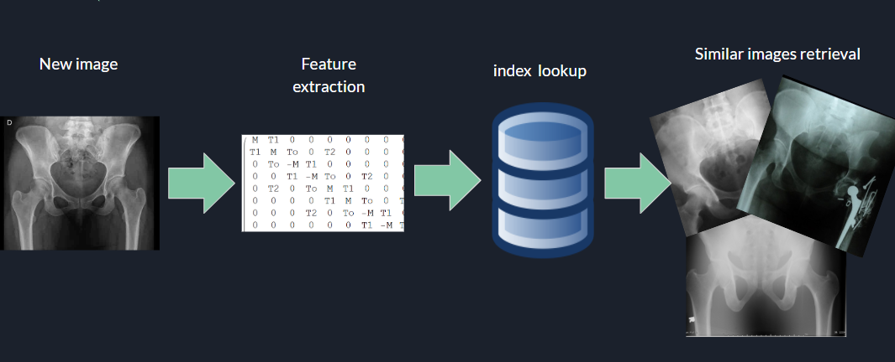

# Image indexer with metadata filtering
This repo hosts an extension of [LIRE](http://www.lire-project.net/), an open source library for content based image retrieval.
LIRE extracts features from an image dataset and builds an index. When presented a new image, LIRE analyzes its composition and retrieves from the index the most similar ones.

This extension uses [Metadata Extractor](https://github.com/drewnoakes/metadata-extractor) to filter the images based on their size and returns the ones which fulfill certain constraints 
To check the details of the project, you can take a look at this [presentation](https://docs.google.com/presentation/d/e/2PACX-1vQmCRQBmWvsQOxH3YBybRPltnI-1TRjYE4oY7-KlwjwZFZWauuqwPtWqMwcE18m0WR2d6MMeBWbjn3I/pub?start=false&loop=false&delayms=3000) 

